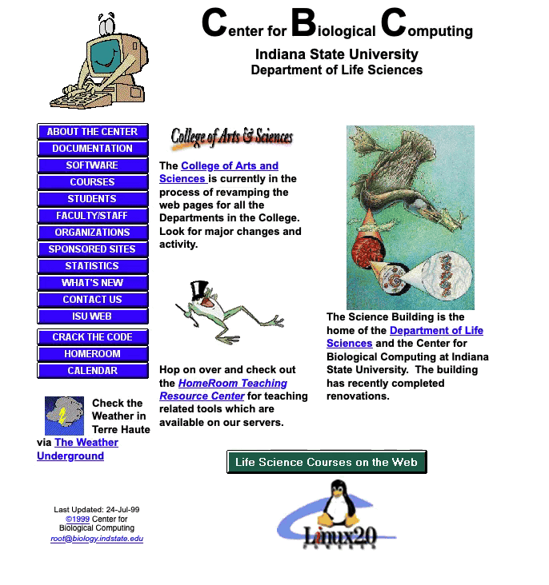

> "I don’t have a photograph, but you can have my footprints. They’re upstairs in my socks." ~ Groucho Marx 

## An Unexpected Search
Several recent events have had me thinking more about open-source.  The same as many people in the 1990s, my introduction to open-source was with Linux.  I remember installing Slackware Linux and later switching to Red Hat Linux.

<!-- more -->

My wife would probably tell you I talked about Linux and open-source too much back then.  I remember finding the topic exciting and wanting to learn more.  Beyond that, what my specific thoughts were on the controversies of the day, I can't remember.  

So I wanted to find a college paper I wrote on Linux on the WayBack Machine to compare with my current thoughts.  

What I found surprised me.  

### Party Like It's 1999
Before I could use the WayBack Machine, I had to remember the home page for the site where I posted my paper.  After much scrunching of my face, I finally remembered my personal site was on [mama.instate.edu](https://mama.indstate.edu).  

I didn't expect to find my paper there because I had requested my account be closed a few years after I graduated, but I wanted to see if it still existed.  

Most of the links no longer work, but the site is still running and looks like it did in 1999!  

{:class="img-responsive"}

### Searching for Answers
Next, I headed over to the [WayBack Machine](https://web.archive.org) to try to find my college paper.  Sadly, my old site had only been captured after I took the paper down, but there was a search engine form on my site.  

On a lark, I tried Yahoo just to see if it still worked.  While I knew that the Internet Archive changes links to keep you within the WayBack machine, I didn't expect the search to work based on keywords.  

> For common terms, it's really cool that you can search Yahoo *in the past* with the WayBack Machine.

Try the link below to check this out.  Just search for a term that is common (baseball, socks, puppies)

[Yahoo Circa 2000](https://web.archive.org/web/20000621090708/http://www.yahoo.com/)

